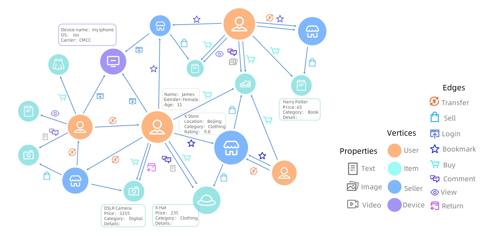
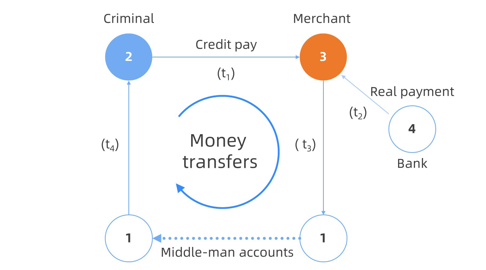
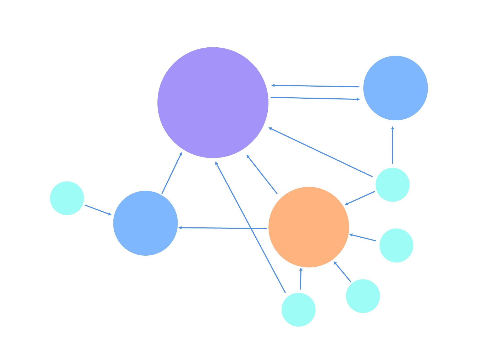
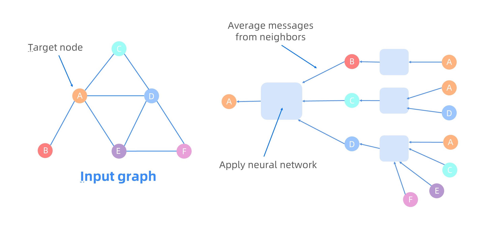
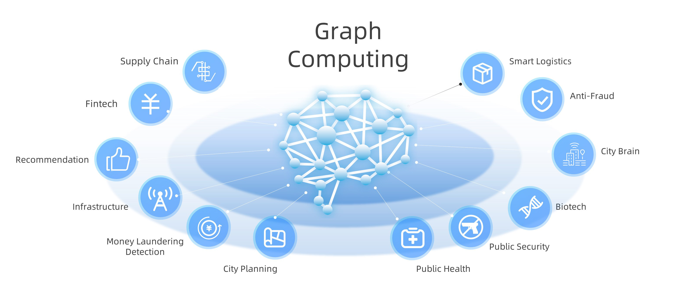

# Background

## What is graph computing

Graph models a set of objects \(vertices\) and their relationships \(edges\). As a sophisticated model, graphs can naturally express a large number of real-life datasets, such as social networks, Web graphs, transaction networks and knowledge graphs. Figure 1 shows an e-commerce graph in Alibaba, where there are various types of vertices \(consumers, sellers, items and devices\) and edges \(purchase, view, comment and so on\), and each vertex is associated with rich attribute information. Current graph data in real industrial scenarios usually contains billions of vertices and trillions of edges. In addition, continuous updates arrive at a tremendous speed. Given the ever-growing amount of graph data available, graph computing, which tries to explore underlying insights hidden in graph data, has attracted increasing attention in recent years. 

<!--  -->

<figure align="center">
  
  <figcaption><b>Figure 1: E-commerce graph at Alibaba.</b></figcaption>
</figure>

According to different aims and characteristics of graph-related tasks, current graph computing can be roughly divided into 3 categories, namely interactive queries on graphs, analytics on graphs and deep learning on graphs. 

**Interactive queries on graphs:** Modern business often requires analyzing large-scale graphs in an exploratory manner in order to locate specific or in-depth information in time, as illustrated using the following example in Figure 2. 

<!--  -->

<figure align="center">
  
  <figcaption><b>Figure 2: An example graph model for fraud detection using interactive query.</b></figcaption>
   
</figure>

The graph depicted in Figure 2 is a simplified version of a real query employed at Alibaba for credit card fraud detection. By using a fake identifier, the “criminal” may obtain a short-term credit from a bank \(vertex 4\). He/she tries to illegally cash out money by forging a purchase \(edge 2 --&gt; 3\) at time $$t_1$$with the help of a merchant \(vertex 3\). Once receiving payment \(edge 4 --&gt; 3\) from the bank \(vertex 4\), the merchant tries to send the money back \(edges 3 --&gt; 1 and 1 --&gt; 2\) to the “criminal” via multiple accounts of a middle man \(vertex 1\) at time $$t_3$$ and $$t_4$$, respectively. This pattern eventually forms a cycle \(2 --&gt; 3 --&gt; 1 … --&gt; 2\). Such fraudulent activities have become one of the major issues for online payments, where the graph could contain billions of vertices \(e.g., users\) and hundreds of billions to trillions of edges \(e.g., payments\). In reality, the entire fraudulent process can involve a complex chain of transactions, through many entities, with various constraints, which thus requires complex interactive analysis to identify. 

**Analytics on graphs:** Analytics on graphs has been studied for decades, and tons of graph analytics algorithms have been proposed for different purposes. Typical graph analytics algorithms include general analytics algorithms \(e.g., PageRank \(see Figure 3\), shortest path, and maximum flow\), community detection algorithms \(e.g., maximum clique/bi-clique, connected components, Louvain and label propagation\), graph mining algorithms \(e.g., frequent structure mining and graph pattern discovery\). Due to the high diversity of graph analytics algorithms, programming models for graph analytics are needed. Current programming models can basically fall into the following categories: “think like a vertex”, matrix algebra, “think like a graph/subgraph” and datalog. With these programming models in place, a lot of graph analytics systems have been developed, such as NetworkX, Pregel, PowerGraph, Apache Giraph and GRAPE. 

<!--  -->

<figure align="center">
  
  <figcaption><b>Figure 3: PageRank, an algorithm to assign an &quot;importance&quot; score for each vertex. In this figure, the diameter of each vertex indicates its PageRank score.</b></figcaption>
   
</figure>

<!--  -->

<figure align="center">
  
  <figcaption><b>Figure 4: Graph neural network.</b></figcaption>
   
</figure>

**Machine learning on graphs:** Classic graph embedding techniques, such as Node2Vec and LINE, have been widely adopted in various machine learning scenarios. Recently Graph Neural Networks \(GNNs\) are proposed, which combine the structural and attribute information in the graph with the power of deep learning technologies. GNNs can learn a low-dimensional representation for any graph structure \(e.g., a vertex, an edge, or an entire graph\) in a graph, and the generated representations can be leveraged by many downstream graph-related machine learning tasks, such as vertex classification, link prediction, graph clustering. Graph learning technologies have demonstrated convincing performance on many graph-related tasks. Different from traditional machine learning tasks, graph learning tasks involve both graph-related and neural network operations \(see Figure 4\). Specifically, each vertex in the graph selects its neighbors using graph-related operations and aggregates its neighbors’ features with neural network operations. 

## **Graph computing: a foundation for the next generation of artificial intelligence** 

The study of graph computing algorithms and systems has been developing rapidly in recent years and become a hot topic in both academia and industry. In particular, the performance of graph computing systems has improved by 10 to 100 times over the past decade and the systems are still becoming increasingly efficient, making it possible to accelerate the AI and big data tasks via graph computing. In fact, graphs are able to naturally express data of various sophisticated types and can provide abstractions for common machine learning models. Compared to dense tensors, the graph representations also offer a much richer semantics and a more comprehensive capability for optimization. Moreover, graphs are a natural encoding of sparse high-dimensional data and the growing research literature in GCN \(graph convolutional network\) and GNN \(graph neural network\) has proven that graph computing is an effective complement to machine learning. 

<!--  -->

<figure align="center">
  
  <figcaption><b>Figure 5: Applications of graph computing.</b></figcaption>
   
</figure>

Putting these together, it is reasonable to expect that graph computing would play a big role in various applications within the next generation of artificial intelligence, including anti-fraud, intelligent logistics, city brain, bioinformatics, public security, public health, urban planning, anti-money laundering, infrastructures, recommender systems, financial technology and supply chains \(see Figure 5\). 

## **Challenges of graph computing**

Although graph computing has been considered as promising solutions for various applications, there is a huge gap between initial ideas and real productions. We summarize that the current large-scale graph computing faces the following challenges. 

1. Real-life graph applications are complex and diverse. In real-life scenarios, a graph-related task is typically very complex and involves multiple types of graph computing. Existing graph computing systems are mostly designed for a specific type of graph computation. Therefore, users have to disassemble a complex task into multiple jobs involving many systems. To bridge different systems, there could be significant overheads such as, extra costs on integration, I/O, format transformation, network and storage. 

2. It is difficult to develop applications for large graphs. To develop a graph computing application, users normally begin with small graphs on a single machine using easy- and ready-to-use tools \(such as NetworkX in Python and TinkerPop\). However, it is extremely difficult for average users to extend their single machine solution to handle large graphs in parallel. Existing distributed parallel systems for large graphs usually follow different programming models, and lack the rich ready-to-use libraries found in the single machine libraries \(e.g., NetworkX\). This makes distributed graph computing a privilege for experienced users only. 

3. The scale and efficiency of processing large graphs is still limited. Although current systems have largely benefited from years of work in optimizations for each individual system, they still suffer from efficiency and/or scale problems. For example, existing interactive graph query systems cannot parallelize the executions for Gremlin queries because of the high complexity of traversal patterns. For graph analytical systems, traditional vertex-centric model makes graph-level optimization unavailable. In addition, many existing systems lack optimizations at the compiler level.
