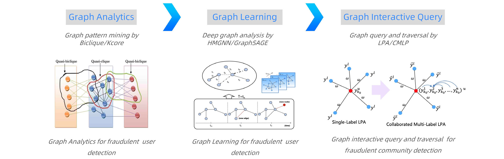

# Case study: anti-fraud and risk control

With the rapid growth of Taobao users, there has been an increasing volume of fraudulent user behaviors on the Taobao platform. These fraudulent behaviors, such as spam transactions, fake comments, risky traffic, bring various threats to our ecosystem. Generally, all the users and transactions can be organized as a large-scale heterogeneous graph which contains both different types of vertices such as buyers, sellers and items, and different types of edges with edge attributes extracted from various retailing scenarios. Facing the heterogeneous graph, GraphScope integrates three types of tools, i.e., graph analytics, graph interactive query, and graph deep learning tools, to enable automatically to recognize spam transactions, fake comments, and risky traffic from huge volumes of Taobao transactions. Moreover, because fraudulent users grow rapidly towards highly organized groups, GraphScope can also identify fraudulent communities by using the graph interactive query tools. To fulfill the need of discovering fraudulent behaviors in real-time, GraphScope implements graph deep learning models especially graph neural networks to recognize and process fake behaviors within a short period of time. 

**One-stop graph computing for fraudulent community detection.** GraphScope can identify fraudulent communities by combining the components of graph analytics, graph interactive query and graph deep learning. Figure 11 displays how GraphScope helps fraudulent community detection in Alibaba. First of all, graph analytics can extract discriminative patterns of each single fraudulent user. We first build a bipartite graph with vertices and edges representing buyers and their purchases of goods. Then, a Biclique subgraph pattern matching algorithm in graph analytics can be used to detect purchase fraud behavior. 

Then, after processing by graph analytics engine, GraphScope calls the component of graph learning to further discover deep complicated patterns of fraudulent users. Graph learning builds a semi-supervised learning model on the large-scale user purchase graph. Specifically, graph neural networks \(GNNs\) are used to integrate the attribute information of vertices and edges with local network structure information to learn deep network representations. 

At the last step, GraphScope uses the component of graph interactive query to discover fraudulent communities. Specifically, label propagation algorithms \(LPA\) in the component of graph traversal can discover fraudulent communities by spreading the class labels of fraudulent users discovered by graph analytics and graph learning. LPA runs in a large-scale decentralized graph, and discovers overlapping fraud communities. 

<!--  -->

<figure align="center">
  
  <figcaption><b>Figure 11: One-stop graph computing for fraudulent community detection.</b></figcaption>
   
</figure>
