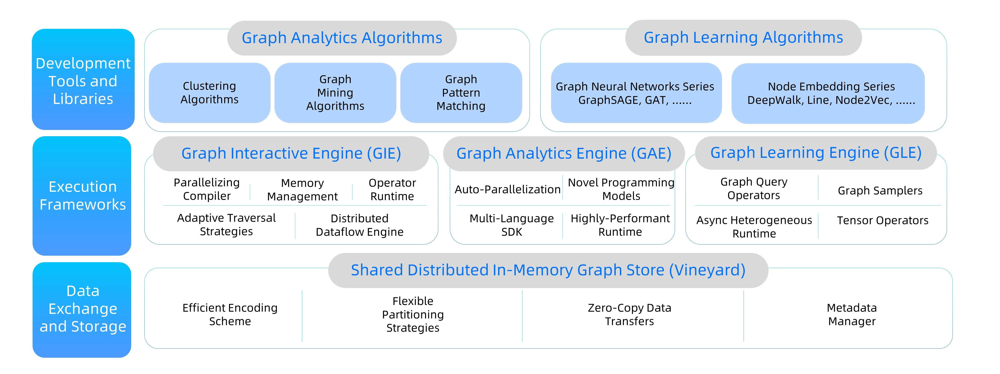
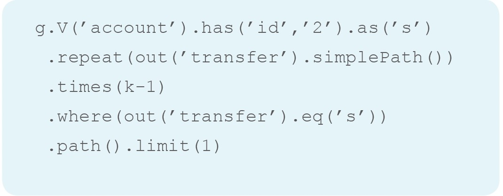
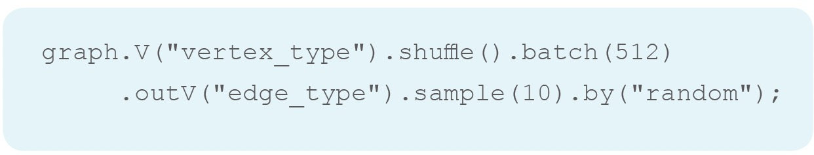
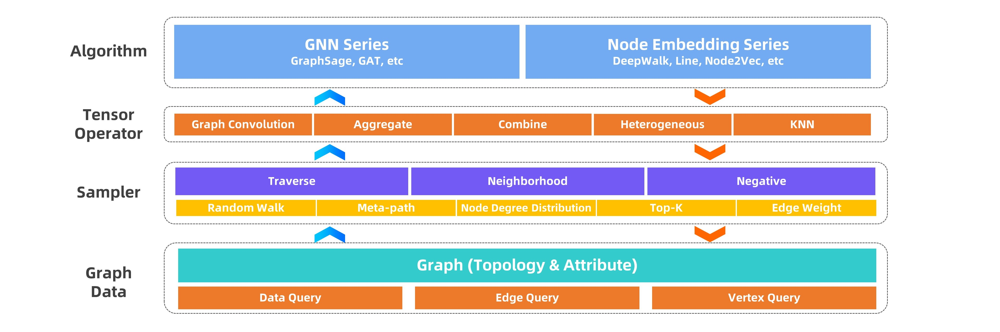

# GraphScope: a one-stop large-scale graph computing system

## Introduction

To tackle the above three challenges, we propose GraphScope, a one-stop large-scale graph computing system. GraphScope aims to provide a single system that is able to support all three types of computation tasks, i.e., graph interactive query, graph analytics and graph deep learning. We carefully design GraphScope with user-friendly interface and extensible programming APIs, so that users can easily construct customized end-to-end graph processing pipelines involving different types of graph computation tasks. In specific, GraphScope fully embraces the Python and Gremlin ecosystem, and thus comes with a shallow learning curve for both data scientists and developers. Under the hood, GraphScope comprises core engines specifically optimized for each graph computation paradigm, and can smoothly orchestrate multiple engines to cooperate efficiently, avoiding the complexity of manually stitching multiple independent systems together. GraphScope can scale to ultra-large graphs, and run in industrial speed and robustness. 

GraphScope has been battle-tested in production in Alibaba and over 30 external customers. GraphScope has supported graph processing tasks on extremely-large and complex graphs, which are of size more than 50TB, and consist of billions of vertices, hundreds of billions of edges, over one hundred labels, and more than one thousand attributes. GraphScope has demonstrated superior performance compared with state-of-the-art graph systems: on the industrial standard LDBC benchmark, GraphScope achieves up-to 5.22B EVPS on 4 nodes of Aliyun nodes for XL-size graphs on the analytical tasks, and nearly linear speed-ups on the SNB interactive queries tasks; GraphScope also speeds up the training time of graph learning models by 50%. In addition, GraphScope provides a rich set of built-in algorithm libraries, covering over 50 graph analysis and graph deep learning algorithms. These libraries, along with the user-friendly interface and APIs, significantly reduce the development cycle of end-to-end graph applications from weeks to days. 

Our endeavor on GraphScope has also been recognized in both academia and industry. We have published tens of research papers on top tier conferences and journals. These research works have won SIGMOD 2017 Best Paper award and VLDB 2017 Best Demo award. Based on GraphScope, we developed a cognitive intelligence computing platform, which won the 'SAIL' prize of the 2019 World Conference on Artificial Intelligence. 

## **Architecture overview**

GraphScope is a full-fledged, in-production system for one-stop analysis on big graph data. Achieving this goal requires a wide variety of components to interact, including cluster management \(deployment\) software, graph store \(as input, output and to hold intermediate results\), distributed execution engines, language constructs, and development tools. Due to the space limit, we highlight the three major layers in GraphScope, namely algorithm, execution, and storage as shown in Figure 6, and give an overview to each of them below. 

<!--  -->

<figure align="center">
  
  <figcaption><b>Figure 6: Architecture of GraphScope.</b></figcaption>
   
</figure>

**Algorithm.** Graph processing often requires specific algorithms for each particular task. While those algorithms can be directly written using the GraphScope's primitives, we have built libraries of common algorithms for various application domains \(such as graph neural networks, clustering, and pattern matching\) to ease the development of new graph applications. GraphScope gives the programmer the illusion of writing for a single machine using a general purpose high-level programming model \(Python\) and to have the system deal with the complexities that arise from distributed execution. This has tremendously simplified the defining and maintaining of such libraries. In addition, this approach allows GraphScope to seamlessly combine multiple graph processing engines in one unified platform as described below. 

**Execution.** GraphScope execution runtime consists of three engines, namely GraphScope Interactive Engine \(GIE\), GraphScope Analytics Engine \(GAE\), GraphScope Learning Engine \(GLE\), and provides the functionality of interactive, analytical, and graph-based machine learning, respectively. A common feature all those execution engines provide is the automatic support for efficient distributed execution of queries and algorithms in their target domains. 

Each query/algorithm is automatically and transparently compiled by GraphScope into a distributed execution plan that is partitioned across multiple compute nodes for parallel execution. Each partition runs on a separate compute node, managed by a local executor, that schedules and executes computation on a multi-core server. 

**Storage.** Because the graph datasets are large, it can take a long time to load input into and save output from multiple processing stages \(between different engines\) within a complex pipeline. To mitigate such cost, GraphScope provides an in-memory storage layer called Vineyard that maintains an \(intermediate\) data object partitioned across a cluster. The storage is tightly coupled with the execution engines for efficiency, so that each local executor \(of any engine\) can access graph data completely avoiding unnecessary data copy. Furthermore, the storage provides high-level abstractions or data structures such as \(sub\)graphs, matrices and tensors as fundamental interfaces to its clients so as to minimize serialization and deserialization cost as well. 

## **Components** 

### **GIE: a parallel interactive engine for graph traversal** 

#### **Challenges of parallelizing the interactive graph query** 

Different from an analytic query that may run minutes to hours without much human involvement, an interactive query allows human to interact with graph data in real time typically using a high-level, declarative query language. Because of such features, interactive query enables human, often non-technical users, to directly explore, examine and present data in order to locate specific or in-depth information at low latency, and is commonly recognized as an essential part of any data analytics project. 

GIE exploits the Gremlin graph traversal language developed by Apache TinkerPop to provide a high-level language for interactive graph queries and provides automatic parallel execution. Gremlin is widely supported by popular graph system vendors such as Neo4j, OrientDB, JanusGraph, Azure Cosmos DB, and Amazon Neptune, which offers a flexible and expressive programming model to enable non-technical users to succinctly express complex traversal patterns in real-world applications. For example, one can write the above fraud-detection query \(Figure 2\) in just a couple of lines using Gremlin, as shown in Figure 7. 

<!--  -->

<figure align="center">
  
  <figcaption><b>Figure 7: An example Gremlin query.</b></figcaption>
   
</figure>

The flexibility of Gremlin mainly stems from nested traversal with dynamic control flow such as loops, which introduces fine-grained data dependencies at runtime that are complex and can incur significant overheads in distributed execution. Therefore, existing Gremlin-enabled, large-scale systems either adopt centralized query processing \(such as JanusGraph and Neptune\), or offer a subset of the language constructs that is often too limited for real-world applications \(in production at Alibaba\), or come as a huge performance sacrifice \(e.g. Hadoop-Gremlin\). In addition, such a system must cope with runtime dynamics related to variations in memory consumption in an interactive context. While several techniques exist for alleviating memory scarcity in distributed execution, such as backpressure and memory swapping, they cannot be directly applied due to potential deadlocks or big latency penalty. 

#### **Efficient graph interactive engine**

We tackle the challenges to scale the Gremlin queries by a novel distributed-system infrastructure designed specifically to make it easy for a variety of users to interactively analyze big graph data on large clusters at low latency. i\) GIE compiles a Gremlin query into a dataflow graph that can be mapped to physical machines for distributed execution, ii\) operators in Gremlin are precompiled and installed on each compute node to allow query plans to be dispatched at low latency, iii\) each local executor employs dynamic scheduling and works together to optimize execution dynamically \(to cope with runtime dynamics related to variations in memory usage and ensure bounded-memory execution\), iv\) finally, the same runtime can be dynamically reconfigured by user-defined graph traversal strategies \(such as depth-first or breadth-first search\) to achieve low latency by avoiding wasted computation. All of the above mechanisms are made possible by a powerful new abstraction we developed in GIE that caters to the specific needs in this new computation model to scale graph queries with complex dependencies and runtime dynamics, while at the same time maintaining the simple and concise programming model. 

The interactive engine has been deployed in production clusters at Alibaba to support a variety of business-critical scenarios. Extensive evaluations using both benchmarks and real-world applications have validated the high-performance and scalability of GIE. Compared to the Gremlin-enabled graph database JanusGraph, GIE outperforms JanusGraph by over one order of magnitude on average using the industry-standard LDBC benchmark. Additionally, GIE can scale to much larger graphs. In the benchmark, we have adopted the largest graph that LDBC benchmark can generate, which contains over 2 billion vertices, 17 billion edges and occupies 2TB aggregated memory in the cluster; in production, GIE has been deployed in Alibaba cluster to process gigantic graphs with hundreds of billions of edges.

### **GAE: a high-performance graph analytics engine** 

#### **Challenges** 

In response to the need of analyzing big graphs, several parallel graph analytics engines have been developed, e.g., Pregel, GraphLab, Trinity, GRACE, Blogel, Giraph++, and GraphX. However, users often find it hard to write and debug parallel graph programs using these systems. The most popular programming model for parallel graph algorithms is the vertex-centric model, pioneered by Pregel and GraphLab. Although graph analytics computing has been studied for decades and a large number of sequential \(single-machine\) graph algorithms are already in place, to use the vertex-centric model, one has to recast the existing sequential algorithms into vertex-centric programs. The recasting is nontrivial for users who are not very familiar with the parallel models. Moreover, none of the systems provides guarantee on the correctness or even termination of parallel programs developed in their models. These make the existing systems a privilege for experienced users only.

<!--  -->

<figure align="center">
  
  <figcaption><b>Figure 8: Programming model used in GAE.</b></figcaption>
   
</figure>

To reduce the programming burden from users while achieving high performance at the same time, we develop a large-scale parallel graph analytics engine, referred to as GAE. 

#### **Auto parallelization** 

GAE follows the GRAPE for auto-prallelization, which proposed in the paper _"Wenfei Fan, Wenyuan Yu,
Jingbo Xu, Jingren Zhou, Xiaojian Luo, Qiang Yin, Ping Lu, Yang Cao, Ruiqi Xu: Parallelizing Sequential
Graph Computations. ACM Trans. Database Syst. 43(4): 18:1-18:39 (2018)"_.
GAE supports a simple paradigm such that to implement a graph analytics algorithm, users only need to provide three sequential \(incremental\) functions, \(1\) PEval, a sequential function for given a query, computes the answer on a local graph; \(2\) IncEval, a sequential incremental function, computes changes to the old output by treating messages among different workers as updates; and \(3\) Assemble, which collects partial answers that are computed locally at each worker by PEval and IncEval, and combines them into a complete answer. In this model, users do not need to know the details of the distributed setting while processing big graphs in a cluster, and GAE auto-parallelizes the graph analytics tasks across a cluster of workers, based on a fixpoint computation. Under a monotonic condition, it guarantees to converge with correct answers as long as the three sequential algorithms provided are correct. That is, GAE parallelizes sequential algorithms as a whole. This makes parallel computations accessible to users who know conventional graph algorithms covered in college textbooks, and there is no need to recast existing graph algorithms into a new model. 

#### **Flexible programming models** 

Existing parallel programming models can be easily adapted and executed on GAE. GAE works on a graph G fragmented via a partition strategy picked by the user and each worker maintains a fragment of G. Given a query, GAE posts the same query to all the workers. As shown in the Figure 8, it computes Q\(G\) in three phases following BSP \(Bulk Synchronous Parallel\). More specifically, each worker first executes PEval against its local fragment, to compute partial answers in parallel. This facilities data-partitioned parallelism via partial evaluation. Then each worker may exchange partial results with other processors via synchronous message passing. Upon receiving messages, each worker incrementally computes IncEval. The incremental step iterates until no further messages can be generated. At this point, Assemble pulls partial answers and assembles the final result. 

#### **Multi-language SDKs** 

Multi-language SDKs are provided by GAE. Users choose to write their own algorithms in either C++ or Python. With Python, users can still expect a high performance. GAE integrated a compiler built with Cython. It can generate efficient native code from Python algorithms behind the scenes, and dispatch the code to the GraphScope cluster for execution. The SDKs further lower the total cost of ownership of graph analytics. 

#### **High-performance runtime**

GAE achieves high performance through a highly optimized analytical runtime based on libgrape-lite. Many optimization techniques, such as pull/push dynamic switching, cache-efficient memory layout, and pipelining were employed in the runtime.It performs well in LDBC Graph Analytics Benchmark, and outperforms other state-of-the-art graph systems. GAE is designed to be highly efficient and flexible, to cope with the scale, variety and complexity from real-life graph analytics applications.

### **GLE: an end-to-end graph learning framework**  

#### **Challenges** 

Graph deep learning algorithms, including graph embedding \(GE\) and graph neural networks \(GNN\), have increasingly attracted a lot of interests in both academia and industry since the last decade. Recently, the rising of big data and complex systems brings a quick proliferation of graph data and reveals new insights. We have observed four properties in the vast majority of real-world graph data, namely large-scale, heterogeneous, attributed and dynamic. For example, nowadays e-commerce graphs often contain billions of vertices and tens of billions of edges, with various types and rich attributes, and quickly evolve over time. These properties pose great challenges for embedding and representing graph data: 

1. Graph data, very different from other forms of data, usually exhibits structural irregularity in Euclidean space. It is challenging to scale graph learning algorithms well on real-world graphs with extremely large sizes. Thus, it is a top priority for graph deep learning engines to ensure the time and space efficiencies on large-scale graphs. 

2. Attributed heterogeneous graphs usually contain various types of vertex and edges with different attributes. This rich information is critical for leveraging both inductive and transductive settings and enhancing the representation power of a graph deep learning algorithm. However, it is non-trivial to integrate both the topological structure information and the unstructured attribute information in a unified embedding space. 

#### **An industrial-scale graph deep learning engine** 

GLE is designed for industrial scenarios at the very beginning, and thus is able to efficiently handle large-scale, heterogeneous graph data. We carefully design GLE to be light-weight, portable, extensible, and easily customizable for various kinds of tasks: GLE provides a set of user-friendly programming APIs essential for developing an end-to-end graph learning application, and can smoothly co-work with popular deep learning engines such as TensorFlow and PyTorch to implement task oriented neural network layers. 

#### **User-friendly interface** 

Graph sampling is an essential step in large-scale graph learning. To ease the development of graph sampling, we propose a high-level language named as GSL \(Graph Sampling Language\). GSL features a Gremlin-like syntax, which is a widely adopted graph query language. With GSL, a sampling query can be implemented as a traversal following a user-defined pattern, allowing users to apply customized sampling logics at corresponding vertices and edges. Figure 9 shows an example GSL query, which samples a batch of 512 vertices of type "vertex\_type", and in turn for each vertex samples 10 neighbors following the "edge\_type" edges. 

<!--  -->

<figure align="center">
  
  <figcaption><b>Figure 9: An example graph sampling query.</b></figcaption>
   
</figure>

#### **Modularized and extensible design** 

As shown in Figure 10, we design GLE in a modularized approach, where each module can be extended independently. This design enables GLE to keep up with the pace of the vibrant research and industrial advances in this field. Specifically, GLE abstracts out four layers: graph data layer, sampler layer, tensor operator layer, and algorithm layer. The graph data layer provides basic graph query functionalities, allowing users to query the attribute/label data, vertices and edges of a graph. Users can extend this layer to adapt to their customized graph stores. The sampler layer provides three types of sampling operators \(traverse sampler, neighbor sampler and negative sampler\) and a rich set of built-in sampling operators implementations. The tensor operator layer comprises tensor operations used in graph neural networks. Users can easily plugin their own operators into these two layers when developing new algorithms. The algorithm layer is built on top of the above three layers. We have also incorporated in GLE a library of popular graph learning algorithms, including both graph neural network algorithms and node embedding algorithms. 

<!--  -->

<figure align="center">
  
  <figcaption><b>Figure 10: Modularized design of GLE</b></figcaption>
   
</figure>

#### **Effective distributed runtime** 

To further optimize the sampling performance, GLE caches the remote neighbors for vertices that are visited frequently. In addition, the attribute indexes are also cached to speed up attribute lookups for vertices in each partition. GLE adopts an asynchronous execution engine with the support for heterogeneous hardware, which enables GLE to efficiently overlap a huge number of concurrent operations such as I/Os, sampling and tensor computation. GLE abstracts heterogeneous computation hardware as resource pools, e.g., CPU thread pool and GPU stream pool, and cooperatively schedules fine-grained concurrent tasks. 

### **Vineyard: an in-memory immutable data manager** 

#### **Challenges**

In a common graph computing practice, several different computing systems are involved to tackle different kinds of workloads. Existing solutions usually adopt distributed databases or file systems as the intermedia storage to share distributed data between heterogeneous computing systems that are involved in the task. This brings two significant overheads: 1\) the structural data are transformed from/to the external data storage format \(e.g., tables in relational databases, files in HDFS\) back and forth in the beginning/end of each computation step. Meanwhile, the structure and operations of the data are dismissed. 2\) saving/loading the data to/from the external storage requires lots of memory-copies and disk-IO costs, which becomes the bottleneck of the entire process in more and more cases as the efficiency of the computing systems are growing rapidly. In addition, the lack of managing the data uniformly through the big data task obstructs the application of modern techniques such as data monitoring, data-aware optimization, and fault-tolerance, thus, further decreases the productive efficiency. 

#### **A distributed in-memory data manager** 

To bridge different graph computation systems, a distributed in-memory data manager Vineyard is developed. It provides 1\) in-memory distributed immutable data sharing in a zero-copy fashion to avoid introducing extra I/O costs, 2\) some built-in out-of-box high-level data abstractions with efficient underlying memory layout to share the distributed data with complex structures \(e.g., distributed graphs\). 3\) extensible mechanism to allow to transplant user-defined data structures or functionalities \(e.g., graph partitioning algorithms\) into Vineyard. 4\) metadata management. With Vineyard in place, users can handle large-scale distributed data across different graph computing systems as simple and efficient as local variables, and finish a graph-related task in an end-to-end way. 

#### **Data sharing with zero-cost** 

Vineyard supports various flexible and efficient memory layout for partitioned immutable graph data. Both simple graphs and property graphs are supported. And it utilized a columnar layout of properties of graphs, which can speed-up the computing tasks and make it easier to interact with other data tasks with Apache Arrow efficiently. 

#### **Effective graph partitions with extensible design** 

Vineyard employs the extensible design concept of registry mechanism to facilitate users transplanting their defined data structures into Vineyard. In particular, the extensible design involves three components builders, resolvers and drivers, and allows users to build, resolve and share their data structures easily among different systems and programming languages respectively. In general, the registry mechanism decouples the functionality methods from the definition of Vineyard data structures. For builders and resolvers, users can flexibly register different implementations in different programming languages to build and resolve the same Vineyard data structures, which makes the data structures available to share among different systems and programming languages, and makes it possible to exploit native language optimizations. For drivers, the registry mechanism allows users to flexibly plug-in functionality methods in different programming languages for Vineyard data structures, which assigns required capability to the data structures along with the data analytics process. For graph computing, graph partitioning is critical to both analytics or interactive processing. With the registry mechanism, users can easily extend Vineyard by plugin their own graph partitioning drivers, which can be implemented and optimized in accordance with specific graph computation tasks for further efficiency augmentation. 

#### **Metadata management**

In addition, Vineyard provides management for the metadata of the data stored in Vineyard. It keeps the structures, layouts and properties of the data to construct high-level abstractions \(e.g., graphs, tensors, dataframes\). The metadata managers in a Vineyard cluster communicate with each other through the backend key-value store, e.g., etcd server, to keep the consistency of the distributed data stored in Vineyard. 
